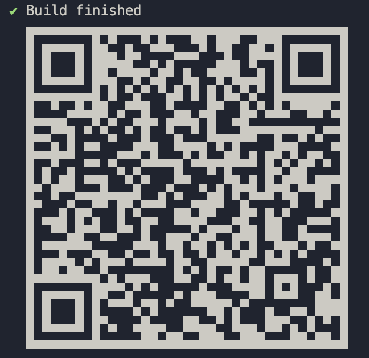

# PROFILE-APP Exercise

Coding Excercise

## Requirements

To run the project, please ensure you have the following installed:

- Long-term support version 14.18.0 or higher [Nodejs](https://nodejs.org/en/).
- Version 6.14.15 npm or higher.
- [Expo Cli](https://docs.expo.dev/), run;

```bash
npm install --global expo-cli
```

- [Yarn](https://classic.yarnpkg.com/lang/en/docs/install/#windows-stable), run;

```bash
npm install --global yarn
```

## Installation

Clone the repository and use the master / main branch.

Run the following commands to update or install required packages.,

```bash
npm install
expo install
```

## Modules

- Create Post
- View Profile
- Required Validation
- Dropdown Choices

## Development and Testing

You ou can download [EXPO GO](https://play.google.com/store/apps/details?id=host.exp.exponent&hl=en&gl=US) in your android mobile device to test the [app](https://expo.dev/@vagenodipa/my-profile-app) on the go!

or Scan using EXPO GO


Source code can be found in `src` directory.

Run the project using [expo cli command](https://docs.expo.dev/workflow/expo-cli/#expo-start)

```bash
expo start
```

If you don't want to use expo cli and want to develop react natively eject fom it using.

```bash
expo eject
```

## Build

To build APK or AAB or IPA, please follow [EXPO documentation](https://docs.expo.dev/build/introduction/) for the ease of build and some tips in deploying the application in the app store and google play.
